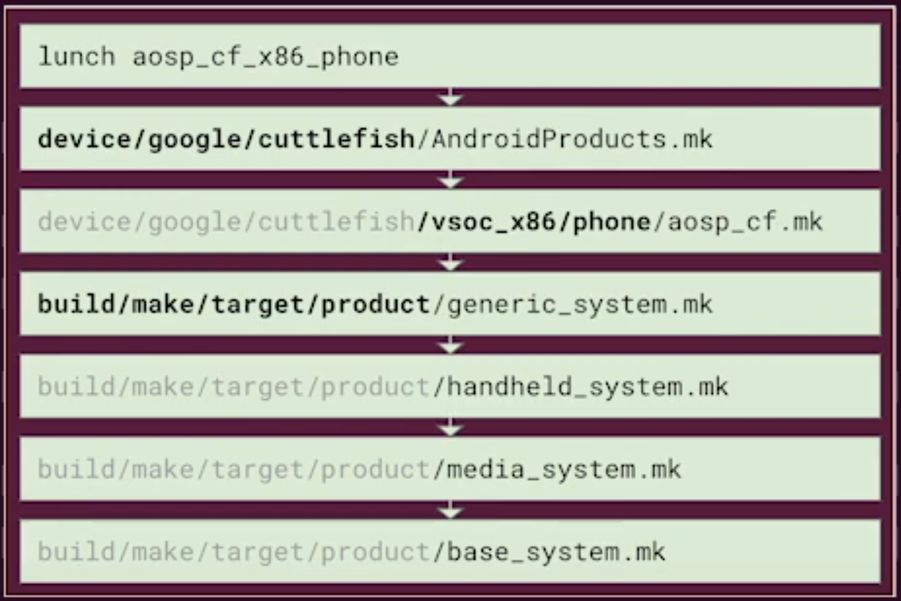

# Android Build System

## Android Make Build System

+ Android recently uses **Android blueprint files** (`*.bp`) or previously **Android makefiles** (`*.mk`) to build the Android OS
+ **Soong** build system parses through the `*.bp` and outputs a **ninja** build file (`*.ninja`)
+ **Ninja** build system parses the `*.ninja` and build the required OS files, including shared objects (`*.so`), java archives (`*.jar`), apps (`*.apk`), and executables


## Android Products Lunch Choices



`lunch` command is implemented in the `build/envsetup.sh` which prints out products that can be build. It gets the values of `COMMON_LUNCH_CHOICES` set by devices' `AndroidProducts.mk` files.
```sh
$ grep -R COMMON_LUNCH_CHOICES ./device
./device/google/cuttlefish/AndroidProducts.mk:COMMON_LUNCH_CHOICES := \
```

When lunching `COMMON_LUNCH_CHOICES=aosp_cf_x86_phone-userdebug`, it will load the makefiles set by `PRODUCT_MAKEFILES=aosp_cf_x86_phone`.
```sh
$ cat ./device/google/cuttlefish/AndroidProducts.mk
PRODUCT_MAKEFILES := \
    aosp_cf_x86_phone:$(LOCAL_DIR)/vsoc_x86/phone/aosp_cf.mk \
    ...
```

In the `aosp_cf.mk`, it is likely to inherit from more generic makefiles.
```sh
$ cat ./device/google/cuttlefish/vsoc_x86/phone/aosp_cf.mk
$(call inherit-product, $(SRC_TARGET_DIR)/product/generic_system.mk)
...

$ grep -R 'SRC_TARGET_DIR :=' ./build
./build/core/config.mk:SRC_TARGET_DIR := $(TOPDIR)/build/make/target
```

Such inheritance can be tracked down to a `base_system.mk` which contains base modules and settings.
```sh
$ cat ./build/make/target/product/base_system.mk
# add APKs and modules/packages to build and install
PRODUCT_PACKAGES += ...
# add modules to build for the host OS, e.g. debugging tools, etc.
PRODUCT_HOST_PACKAGES += ...
# assign modules for eng or userdebug builds only
PRODUCT_PACKAGES_DEBUG := ...
# add source files to be copied to the out/target/product/<product_name>
PRODUCT_COPY_FILES += ...
```
