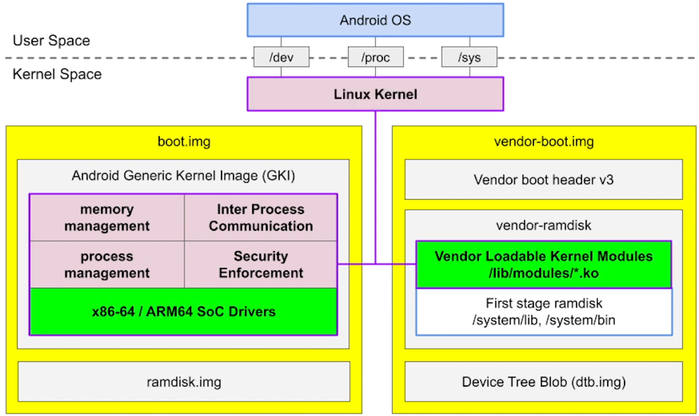
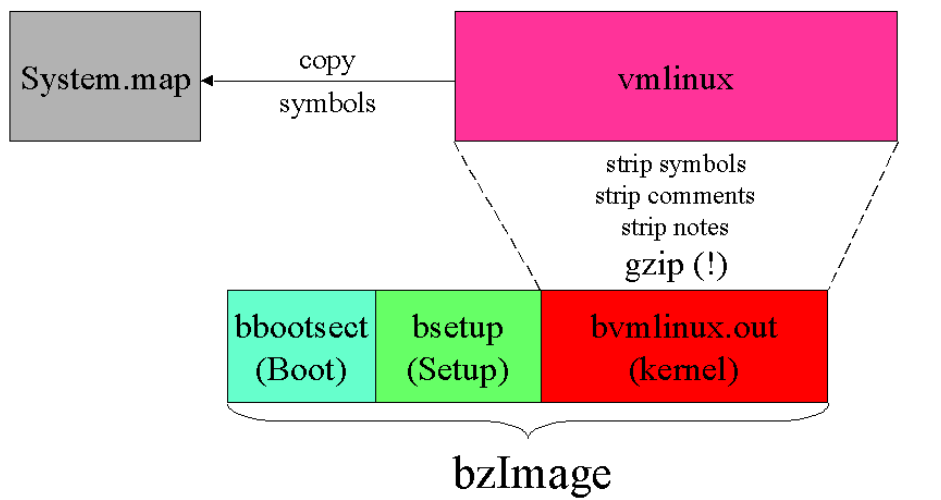

# Android Linux Kernel

Linux kernel is responsible for:
+ memory management
+ IPC
+ process management
+ security enforcement



**Modular kernel** was introduced since Android 8, splitting the device kernel into:
+ GKI
    * [Android kernels list](https://source.android.com/devices/architecture/kernel/android-common#feature-and-launch-kernels)
    * prebuilts can be downloaded from [ci.android.com](https://ci.android.com/builds/branches/aosp_kernel-common-android12-5.10/grid?)
        - for example, download the *aosp_kernel-common-android12-5.10* -> *kernel_x86_64* -> *View artifacts* of the latest change -> `bzImage`
    * located in the `kernel/prebuilts/5.10/x86_64` folder of AOSP project
    * with a stable *Kernel Module Interface (KMI)* for kernel modules
        - modules and kernel can be updated independently
+ vendor kernel modules
    * for virtual devices (e.g. cuttlefish), prebuilts can be downloaded from [ci.android.com](https://ci.android.com/builds/branches/aosp_kernel-common-android12-5.10/grid?) as well
        - download the *aosp_kernel-common-android12-5.10* -> *kernel_virt_x86_64* -> *View artifacts* of the latest change -> everything and `*.ko`

## Build and Replace Cuttlefish's GKI and Kernel Objects

https://source.android.com/setup/build/building-kernels#building-gki-modules

1. Download the Android Common Kernel source
```sh
$ mkdir -p ~/android-kernel && cd ~/android-kernel
$ repo init -u https://android.googlesource.com/kernel/manifest -b common-android12-5.10
$ repo sync -j8

# check the kernel version
$ cd ~/android-kernel/common
$ make kernelversion
5.10.81
```

2. Build the **GKI** for the x86_64 device
```sh
$ cd ~/android-kernel
$ BUILD_CONFIG=common/build.config.gki.x86_64 build/build.sh
Kernel: arch/x86/boot/bzImage is ready
```


3. Build the **common modules** for the virtual device (Cuttlefish)
```sh
$ cd ~/android-kernel
$ BUILD_CONFIG=common-modules/virtual-device/build.config.virtual_device.x86_64 build/build.sh
# check kernel modules/objects generated
$ ls ~/android-kernel/out/android12-5.10/dist/*.ko
```

4. Create `custom_kernel` folder in the AOSP project
```sh
$ mkdir -p ~/aosp/custom_kernel
$ cp ~/android-kernel/out/android12-5.10/dist/bzImage ~/aosp/custom_kernel
$ cp ~/android-kernel/out/android12-5.10/dist/*.ko ~/aosp/custom_kernel
```

5. Change to the custom GKI in the `kernel.mk`
```sh
$ vi device/google/cuttlefish/vsoc_x86_64/kernel.mk
PRODUCT_COPY_FILES += custom_kernel/bzImage:kernel
```

6. Change to the custom kernel modules in the `BoardConfig.mk`
```sh
$ vi device/google/cuttlefish/vsoc_x86/BoardConfig.mk
BOARD_VENDOR_RAMDISK_KERNEL_MODULES += $(wildcard custom_kernel/*.ko)
```

7. Launch cuttlefish and check current Linux kernel version before building
```txt
vsoc_x86:/ # cat /proc/version
Linux version 5.10.43-android12-9-00031-...
```

8. Build the AOSP again and check the updated kernel version
```txt
$ m -j8
vsoc_x86:/ # cat /proc/version
Linux version 5.10.81-android12-9-00159-...
```
