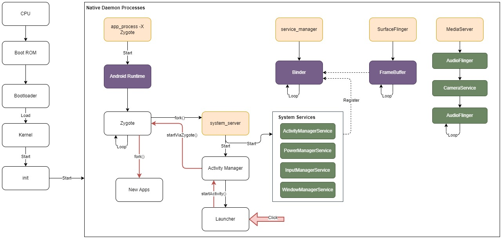

# Android OS Boot Process

## CPU / Boot ROM

A  write-protected flash ROM memory in the processor chip, containing the very first code to execute at power-cycle, e.g. starting the bootloader.

## Bootloader

Execute to set up, and load the kernel image to working memory.

## Kernel

Set up the cache / memory, and load the drivers. After finishing system setup, it starts the `init` root process.

## `init`

A root process with two responsibilities:
+ mount paths, e.g. `/sys`, `/dev`, `/proc`
+ run `init.rc` script to start daemon processes

### Zygote

Android runtime is started by the `init`, with `app_process` command:
+ start *Art*/*Dalvik* process virtual machine
	+ *Dalvik*: Android 5 or earlier, just-in-tim (JIT) compilation
	+ *Art*: ahead-of-time (AOT) compilation
+ call *Zygote* main function
	+ special OS process enabling shared code across virtual machine
		+ in Java VM, each instance has its own copy of code library class files and head objects
	+ explicitly start the **system server** process
	+ respond to fork requests by new apps

### System Server

+ initialize system services, register them with **service manager**
+ start the **activity manager**

#### Activity Manager

+ create a new Activity process
+ maintain the Activity lifecycle
+ manage the Activity stack
+ execute an `Intent` to start a Home Launcher
