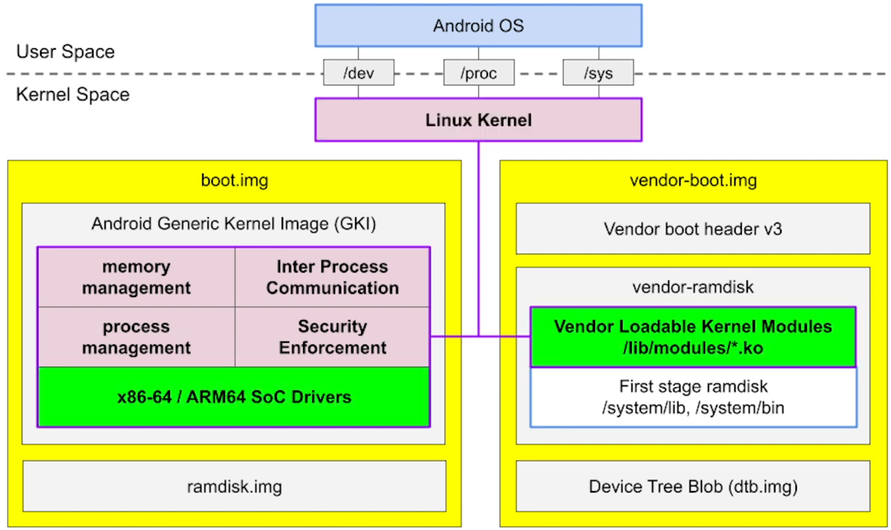

# Linux Kernel

Linux kernel is responsible for:
+ memory management
+ IPC
+ process management
+ security enforcement

**Modular kernel** was introduced since Android 8, splitting the device kernel into:
+ GKI
    * [Android kernels list](https://source.android.com/devices/architecture/kernel/android-common#feature-and-launch-kernels)
    * prebuilts can be downloaded from [ci.android.com](https://ci.android.com/builds/branches/aosp_kernel-common-android12-5.10/grid?)
        - for example, download the *aosp_kernel-common-android12-5.10* -> *kernel_x86_64* -> *View artifacts* of the latest change -> `bzImage`
    * located in the `kernel/prebuilts/5.10/x86_64` folder of AOSP project
    * with a stable *Kernel Module Interface (KMI)* for kernel modules
        - modules and kernel can be updated independently
+ vendor kernel modules
    * for virtual devices (e.g. cuttlefish), prebuilts can be downloaded from [ci.android.com](https://ci.android.com/builds/branches/aosp_kernel-common-android12-5.10/grid?) as well
        - download the *aosp_kernel-common-android12-5.10* -> *kernel_virt_x86_64* -> *View artifacts* of the latest change -> everything and `*.ko`