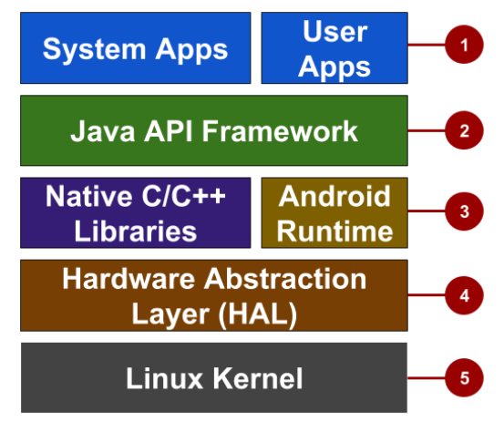

# Android OS Architecture

1. **Apps**
2. **Java API Framework:** APIs for all Android features. Only need to know how to use them, no need to know how they work
3. **Libs and Runtime:** system components/services built in native C/C++; runtime libs for app to run in its own process
4. **HAL:** standard interfaces that expose hardware capabilities to higher levels
5. **Linux Kernel:** foundation that provides threading, low-level memory management, and other core functionalities
