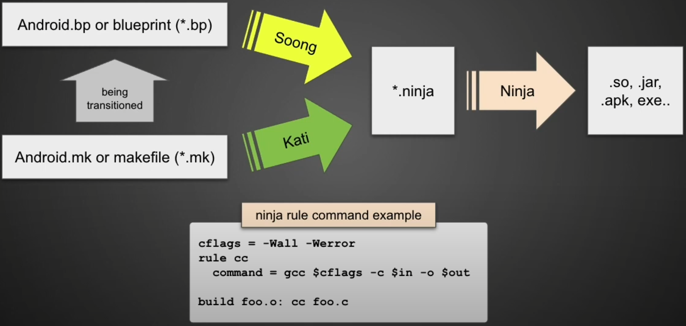
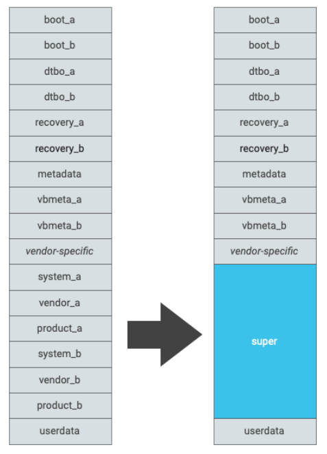

# Android Build System

## Android Make Build System

+ Android recently uses **Android blueprint files** (`*.bp`) or previously **Android makefiles** (`*.mk`) to build the Android OS
+ **Soong** build system parses through the `*.bp` and outputs a **ninja** build file (`*.ninja`)
+ **Ninja** build system parses the `*.ninja` and build the required OS files, including shared objects (`*.so`), java archives (`*.jar`), apps (`*.apk`), and executables



## Android Products Lunch Choices


`lunch` command is implemented in the `build/envsetup.sh` which prints out products that can be build. It gets the values of `COMMON_LUNCH_CHOICES` set by devices' `AndroidProducts.mk` files.

```sh
$ grep -R COMMON_LUNCH_CHOICES ./device
./device/google/cuttlefish/AndroidProducts.mk:COMMON_LUNCH_CHOICES := \
```

### Example of `aosp_cf_x86_phone`

When lunching `COMMON_LUNCH_CHOICES=aosp_cf_x86_phone-userdebug`, it will load the makefiles set by `PRODUCT_MAKEFILES=aosp_cf_x86_phone`.

```sh
$ cat ./device/google/cuttlefish/AndroidProducts.mk
PRODUCT_MAKEFILES := \
    aosp_cf_x86_phone:$(LOCAL_DIR)/vsoc_x86/phone/aosp_cf.mk \
    ...
```

In the `aosp_cf.mk`, it is likely to inherit from more generic makefiles.

```sh
$ cat ./device/google/cuttlefish/vsoc_x86/phone/aosp_cf.mk
$(call inherit-product, $(SRC_TARGET_DIR)/product/generic_system.mk)
...

$ grep -R 'SRC_TARGET_DIR :=' ./build
./build/core/config.mk:SRC_TARGET_DIR := $(TOPDIR)/build/make/target
```

Such inheritance can be tracked down to a `base_system.mk` which contains base modules and settings.

```sh
$ cat ./build/make/target/product/base_system.mk

# add APKs and modules/packages to build and install
PRODUCT_PACKAGES += ...

# add modules to build for the host OS, e.g. debugging tools, etc.
PRODUCT_HOST_PACKAGES += ...

# assign modules for eng or userdebug builds only
PRODUCT_PACKAGES_DEBUG := ...

# add source files to be copied to the out/target/product/<product_name>
PRODUCT_COPY_FILES += ...
```


## Android Partitions

| Image name | Content | Output folder `out/target/product/vsoc_x86` | Device mounting point |
|------------|---------|---------------------------------------------|-----------------------|
| [ramdisk.img](https://source.android.com/devices/bootloader/partitions#standard-partitions) | <ul><li>empty folders that get mounted on boot</li><li>`init.environ.rc`</li></ul> | `./root` | `/` |
| [boot.img](https://source.android.com/devices/bootloader/partitions#standard-partitions) | <ul><li>Generic Kernel Image (GKI)</li><li>`ramdisk.img`</li></ul> | <ul><li>kernel: external</li><li>ramdisk: `./root`</li></ul> | kernel isn't mounted in user space, but drivers are exposed in `/dev`, `/sys`, `/proc` |
| [system.img (GSI)](https://source.android.com/setup/build/gsi) | generic libs, apps, executables, XMLs, fonts, etc. | `./system` | `/system` |
| [system_ext.img](https://source.android.com/devices/bootloader/partitions#changes-in-android-r) | <ul><li>AOSP system modules that are not yet in the GSI</li><li>Customizable modules such as the Settings & CarrierConfig</li></ul> | `./system_ext` | `/system_ext` |
| [product.img](https://source.android.com/devices/bootloader/partitions/product-partitions) | product-specific or product group modules and configurations | `./product` | `/product` |
| [odm.img](https://source.android.com/devices/bootloader/partitions/odm-partitions) | board-specific modules and configurations (BSPs) | `./odm` | `/odm` |
| [vendor.img](https://source.android.com/devices/bootloader/partitions/system-as-root#using-vendor-overlay) | SOC-specific modules | `./vendor` | `/vendor` |
| [vendor_boot.img](https://source.android.com/devices/bootloader/partitions/vendor-boot-partitions) | <ul><li>[dtb.img](https://source.android.com/devices/bootloader/dtb-images): Device Tree Blob [overlays](https://source.android.com/devices/architecture/dto) vendor-specific kernel drivers</li><li>vendor-specific kernel drivers</li></ul> | e.g. `device/google/redfin-kernel/*.ko` | kernel space |
| cache.img | empty until first boot | `./cache` | `/cache`
| userdata.img | mostly empty until first boot | `./data` | `/data` |
| [metadata.img](https://source.android.com/security/encryption/metadata#set-up-metadata-filesystem) | keymaster blobs that protect the encryption key | | `/metadata` |
| [super.img](https://source.android.com/devices/tech/ota/dynamic_partitions/implement#implement-dynamic-partitions-new-devices) | system.img, system_ext.img, product.img, vendor.img & odm.img | see individual images | see individual images |

In the cuttlefish device makefile `aosp_cf.mk`, it inherits multiple other image makefiles:

```sh
$ cat ./device/google/cuttlefish/vsoc_x86/phone/aosp_cf.mk

# system.img
$(call inherit-product, $(SRC_TARGET_DIR)/product/generic_system.mk)

# system_ext.img
$(call inherit-product, $(SRC_TARGET_DIR)/product/handheld_system_ext.mk)
$(call inherit-product, $(SRC_TARGET_DIR)/product/telephony_system_ext.mk)

# product.img
$(call inherit-product, $(SRC_TARGET_DIR)/product/aosp_product.mk)

# vendor.img
$(call inherit-product, device/google/cuttlefish/shared/phone/device_vendor.mk)
```

+ `/system_ext` modules
	+ can be customized
	+ cannot be removed
+ `/product` modules
	+ optional
	+ can be replaced by different vendor apps

### Dynamic partitions

+ supports for `system`, `system_ext`, `product`, `vendor` & `odm` partitions
+ With [dynamic partitions](https://source.android.com/devices/tech/ota/dynamic_partitions), we can create/resize/destroy partitions during the OTA
+ a `super` partition is allocated on the device, sub-partitions can be sized dynamically within it
+ vendors don't need to worry about the individual sizes of sub-partitions because the remaining free space in the `super` is available for all

In the cuttlefish device makefile `./device/google/cuttlefish/vsoc_x86/phone/aosp_cf.mk`:
+ inherit `device/google/cuttlefish/shared/phone/device_vendor.mk` for `vendor` partition
	+ inherit the `device/google/cuttlefish/shared/device.mk`
		+ [enable the dynamic partitions](https://source.android.com/devices/tech/ota/dynamic_partitions/implement#device-configuration-changes): `PRODUCT_USE_DYNAMIC_PARTITIONS := true`
+ define the `PRODUCT_DEVICE := vsoc_x86`
	+ build system will search for the `device/google/cuttlefish/vsoc_x86/BoardConfig.mk`
		+ include `device/google/cuttlefish/shared/BoardConfig.mk`
			+ set `BOARD_SUPER_PARTITION_SIZE`, `BOARD_SUPER_PARTITION_GROUPS`

### A/B system updates

+ A/B system updates use two sets of partitions referred to as **slots**
+ system runs from the current slot while the unused slot are saved for the next download OTA update
+ to implement [A/B system updates](https://source.android.com/devices/tech/ota/ab/ab_implement), their bootloader must implement the *boot_control* HAL
+ in the `device/google/cuttlefish/shared/device.mk`
	+ set `AB_OTA_UPDATER := true`, `AB_OTA_PARTITIONS += ...`


